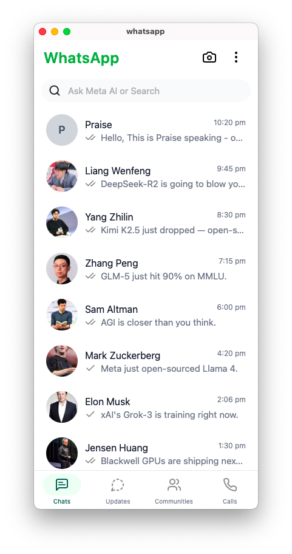
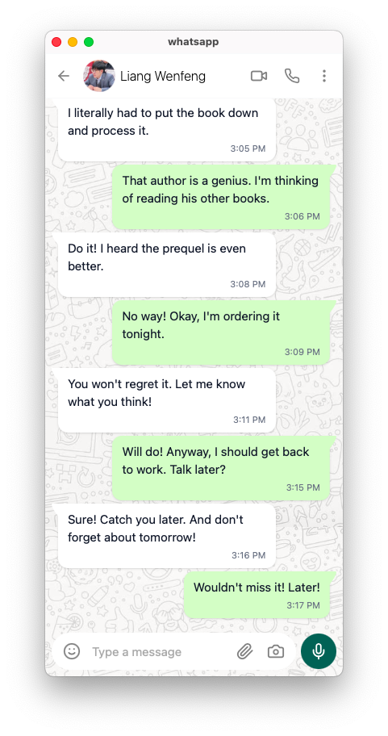

# WhatsApp Clone — Dioxus 0.7

A fully client-side WhatsApp UI clone built with **[Dioxus 0.7](https://dioxuslabs.com/learn/0.7)** — a Rust framework for building cross-platform user interfaces. This project replicates the look, feel, and navigation of the official WhatsApp mobile application, including the chat list, conversation view, and bottom tab navigation.

---

## Table of Contents

- [Screenshots](#screenshots)
- [Features](#features)
- [Technology Stack](#technology-stack)
- [Project Architecture](#project-architecture)
- [Routes](#routes)
- [Component Tree](#component-tree)
- [Data Layer](#data-layer)
- [UI Details](#ui-details)
  - [Home Screen](#home-screen)
  - [Chat Screen](#chat-screen)
  - [Footer Navigation](#footer-navigation)
- [Getting Started](#getting-started)
- [Building for Production](#building-for-production)

---

## Demo Video

https://github.com/user-attachments/assets/whatsapp.mov

A walkthrough of the application showing the chat list, navigation between tabs, and the conversation screen with message bubbles and input controls.

## Screenshots

### Home Screen — Chat List



The main chat list screen displays the WhatsApp header, search bar, filter tags, and a scrollable list of recent conversations. Each chat row shows the contact's profile picture, name, latest message preview, timestamp, and delivery status indicator (sent/delivered/read).

### Chat Screen — Conversation View



The individual chat screen displays a full conversation thread with message bubbles styled after WhatsApp's green-and-white design, a profile header with call/video buttons, and a bottom input bar with emoji, attachment, camera, and microphone controls.

---

## Features

- **WhatsApp-Style Chat List** — Displays 10 mock contacts with profile pictures, names, message previews, timestamps, and read/delivery status indicators (single check, double check, blue double check).
- **Filter Tags** — Horizontally scrollable tag chips for filtering conversations: All, Unread, Favourites, Groups, and a "+" button.
- **Conversation Thread** — Fully detailed chat screen with 30+ mock messages, alternating sent/received bubbles with tail shapes and WhatsApp-green color (#DCF8C6) for sent messages.
- **Message Status Indicators** — Visual icons showing message status: single check (Sent), double check (Delivered), blue double check (Read).
- **Bottom Tab Navigation** — Four-tab footer bar with active state highlighting: Chats, Updates, Communities, Calls.
- **Search Bar** — Integrated search bar labeled "Ask Meta AI or Search" with a search icon.
- **Chat Header** — Contact-level header with back navigation, profile picture, name, video call, voice call, and overflow menu buttons.
- **Input Toolbar** — Bottom message input area with emoji picker, text input, paperclip attachment, camera, and microphone buttons — mirroring the real WhatsApp layout.
- **Chat Background Pattern** — Tiled background image with blend-mode overlay replicating the WhatsApp chat wallpaper effect.
- **Responsive Layout** — Uses Tailwind CSS for full-screen mobile-optimized layout with flexbox and snap scrolling.
- **Client-Side Routing** — SPA-style routing with Dioxus Router for seamless navigation between pages.
- **Cross-Platform** — Configured to build for desktop (native), web (WASM), and mobile targets through Cargo features.

---

## Technology Stack

| Technology      | Version | Purpose                                      |
|-----------------|---------|----------------------------------------------|
| **Dioxus**      | 0.7.1   | UI framework (reactive, component-based)     |
| **Dioxus Router** | 0.7   | Client-side routing with nested layouts      |
| **Rust**        | 2021 ed.| Systems programming language                 |
| **Tailwind CSS** | 4.x    | Utility-first CSS framework (auto-managed by `dx serve`) |
| **dioxus-free-icons** | 0.10 | Icon library (Lucide + Font Awesome Solid) |
| **Cargo**       | —       | Build system and dependency manager          |

Feature flags for platform targets:
- `default = ["desktop"]` — Native desktop app via WebView
- `web = ["dioxus/web"]` — WebAssembly browser app
- `desktop = ["dioxus/desktop"]` — Desktop native build
- `mobile = ["dioxus/mobile"]` — Mobile native build

---

## Project Architecture

```
whatsapp/
├── assets/
│   ├── background.png          # Chat screen tiled wallpaper
│   ├── favicon.ico             # Browser tab icon
│   ├── header.svg              # Header vector graphic
│   ├── preview/
│   │   ├── chat.png            # Chat screen preview screenshot
│   │   └── home.png            # Home screen preview screenshot
│   ├── profile.png             # Default contact profile picture
│   ├── styling/
│   │   ├── blog.css            # Blog page styling
│   │   ├── main.css            # Main application styling
│   │   └── navbar.css          # Navigation bar styling
│   └── tailwind.css            # Compiled Tailwind CSS output
├── src/
│   ├── main.rs                 # Application entrypoint, module declarations
│   ├── app.rs                  # Root component (loads CSS, mounts Router)
│   ├── route.rs                # Route definitions (enum + layout)
│   ├── data/
│   │   ├── mod.rs              # Data module re-exports
│   │   ├── chats.rs            # Mock chat list data (10 contacts)
│   │   ├── messages.rs         # Mock message thread data (30+ messages)
│   │   └── tags.rs             # Tag filter definitions
│   ├── components/
│   │   ├── mod.rs              # Components module re-exports
│   │   ├── header.rs           # Top bar with "WhatsApp" + camera + menu
│   │   ├── search.rs           # Search bar component
│   │   ├── tags.rs             # Horizontal scrollable filter tags
│   │   ├── chats.rs            # Chat row list with status indicators
│   │   ├── message.rs          # Individual message bubble component
│   │   ├── footer.rs           # Bottom tab navigation bar
│   │   └── divider.rs          # Utility divider component
│   └── views/
│       ├── mod.rs              # Views module re-exports
│       ├── home.rs             # Main chat list page
│       ├── chat.rs             # Individual conversation page
│       ├── root_layout.rs      # Shared layout (outlet + footer)
│       ├── updates.rs          # Updates/Status page (placeholder)
│       ├── communities.rs      # Communities page (placeholder)
│       └── calls.rs            # Calls page (placeholder)
├── Cargo.toml                  # Rust dependencies and feature flags
├── Dioxus.toml                 # Dioxus project configuration
├── clippy.toml                 # Rust Clippy linter configuration
├── tailwind.css                # Tailwind CSS input (source)
├── .gitignore                  # Git ignore rules
└── README.md                   # This file
```

---

## Routes

The application uses Dioxus Router with a nested layout structure. All routes are defined as variants of the `Route` enum in `src/route.rs`:

| Path            | Component      | Description                           |
|-----------------|----------------|---------------------------------------|
| `/`             | `Home`         | Main chat list screen                 |
| `/updates`      | `Updates`      | Status updates page (placeholder)     |
| `/communities`  | `Communities`  | Communities page (placeholder)        |
| `/calls`        | `Calls`        | Call history page (placeholder)       |
| `/chat/:index`  | `Chat`         | Individual conversation by index      |

### Layout Structure

The `#[layout(RootLayout)]` attribute wraps the four main tabs (Home, Updates, Communities, Calls) inside a shared layout that renders the page content via `Outlet<Route>` and the `Footer` navigation bar beneath it. The Chat route is rendered outside this layout — it has its own full-screen header and does not show the bottom tab bar.

```
Router
└── RootLayout
    ├── Outlet<Route>
    │   ├── Home         → Header + Search + Tags + Chats
    │   ├── Updates      → Placeholder text
    │   ├── Communities  → Placeholder text
    │   └── Calls        → Placeholder text
    └── Footer           → Chats | Updates | Communities | Calls
└── Chat (full-screen, no footer)
```

---

## Component Tree

### Home Screen (`/`)

```
Home
├── Header
│   ├── "WhatsApp" title (green, 25px)
│   ├── Camera button (Lucide icon)
│   └── More options button (ellipsis vertical)
├── Search
│   ├── Search icon (Lucide)
│   └── Input field ("Ask Meta AI or Search")
├── Tags
│   ├── "All" tag (green-highlighted)
│   ├── "Unread" tag
│   ├── "Favourites" tag
│   ├── "Groups" tag
│   └── "+" tag
└── Chats (scrollable list)
    └── Chat Row (×10)
        ├── Profile picture (circular)
        ├── Contact name (bold)
        ├── Timestamp (right-aligned)
        ├── Message status icon
        │   ├── Single check    → Sent
        │   ├── Double check    → Delivered
        │   └── Blue double check → Read
        └── Message preview (truncated)
```

### Chat Screen (`/chat/:index`)

```
Chat
├── Header
│   ├── Back button (arrow left)
│   ├── Contact profile picture
│   ├── Contact name
│   ├── Video call button
│   ├── Voice call button
│   └── More options (ellipsis vertical)
├── Messages Area (scrollable, tiled background)
│   └── Message (×30+)
│       ├── Sent bubble (green #DCF8C6, right-aligned, tail)
│       └── Received bubble (white, left-aligned, tail)
│           ├── Text content
│           └── Timestamp
└── Input Bar
    ├── Smiley/emoji button
    ├── Text input ("Type a message")
    ├── Paperclip attachment
    ├── Camera button
    └── Microphone button (green circle #075E54)
```

### Footer Navigation

```
Footer
├── Chats tab (Lucide: MessageSquareText)
│   └── Active state: green text + green-50 background
├── Updates tab (Lucide: MessageCircleDashed)
├── Communities tab (Lucide: Users)
└── Calls tab (Lucide: Phone)
```

---

## Data Layer

All data is currently **static/mock** — there is no backend, database, or API integration. Data is hardcoded in the `src/data/` module.

### `chats.rs` — Chat List Data

Returns a `Vec<ChatInfo>` with 10 contacts. Each `ChatInfo` contains:

| Field     | Type            | Description                    |
|-----------|-----------------|--------------------------------|
| `name`    | `String`        | Contact display name           |
| `message` | `String`        | Last message preview text      |
| `time`    | `String`        | Timestamp of last message      |
| `status`  | `MessageStatus` | Delivery status (Sent/Delivered/Read) |

Mock contacts include characters like Sam Altman, Mark Zuckerberg, Elon Musk, Jensen Huang, and others, each with AI-themed message previews.

### `messages.rs` — Conversation Thread

Returns a `Vec<Msg>` with 30+ messages simulating a real back-and-forth conversation between two people. Each `Msg` contains:

| Field  | Type      | Description                                |
|--------|-----------|--------------------------------------------|
| `text` | `String`  | Message content text                       |
| `time` | `String`  | Timestamp string (e.g., "10:30 AM")        |
| `sent` | `bool`    | `true` for sent (green bubble), `false` for received (white bubble) |

### `tags.rs` — Filter Tags

Returns a `Vec<String>` with five tags: `All`, `Unread`, `Favourites`, `Groups`, and `+`.

### State Management

This project uses **no external state management**. The current architecture relies on:
- **Local data functions** (`get_chats()`, `sample_messages()`, `get_tags()`) that return static data
- **Navigator hooks** (`use_navigator()`, `use_route()`) for routing and active tab tracking
- **Route parameters** (`Chat { index: usize }`) for selecting which conversation to display

---

## UI Details

### Home Screen

The home screen is the entry point of the application and closely mirrors the WhatsApp mobile UI:

- **Header**: Displays the WhatsApp logo in bold green (#16A34A / green-600) at 25px, flanked by a camera icon and a vertical ellipsis (more options) icon — matching the real app exactly.
- **Search Bar**: A rounded search input field with a gray background (#F9FAFB / gray-50), containing a search icon and the placeholder text "Ask Meta AI or Search" (mirroring Meta AI integration in WhatsApp).
- **Tags Row**: A horizontally scrollable set of filter chips. The first tag "All" uses a green-tinted background (green-100/95) to indicate it is the active/default filter. Remaining tags use transparent backgrounds with gray borders. Tags are displayed with `whitespace-nowrap` to prevent text wrapping, and the container uses `overflow-x-auto` for horizontal scrolling.
- **Chat List**: Each chat row is a flex row containing:
  - A circular profile picture (48px × 48px via `w-13 h-13`) sourced from `/assets/profile.png`.
  - The contact name displayed at 16px with `truncate` for overflow handling.
  - The timestamp right-aligned at 12px in gray.
  - A message status icon: single check mark (`LdCheck`) for Sent, double check (`LdCheckCheck`) for Delivered, and a green-tinted double check for Read.
  - The message preview text at 15px in gray with `truncate` and `leading-tight`.
  - Rows are interactive with hover (gray-50) and active (gray-100) state transitions, plus `snap-start` for scroll snapping.
- **Scroll Behavior**: The chat list area uses `overflow-y-auto` with `snap-y snap-proximity` for iOS-style scroll snapping.

### Chat Screen

Tapping a chat row navigates to the Chat screen, which renders a full conversation view:

- **Header**: A 56px-tall white bar containing:
  - Back arrow button (Lucide `LdArrowLeft`) — calls `nav.go_back()` on click.
  - Circular profile picture (40px × 40px).
  - Contact name in medium weight.
  - Action buttons: Video call (`LdVideo`), Voice call (`LdPhone`), and More options (`LdEllipsisVertical`).
- **Messages Area**: A flex-grow scrollable container with:
  - A tiled background image (`background.png`) repeated at 400px size with `multiply` blend mode and a light overlay color (#ECE5DD at 10% opacity) — replicating the classic WhatsApp chat wallpaper effect.
  - Each message bubble is rendered by the `Message` component:
    - **Sent bubbles**: Right-aligned with a green background (#DCF8C6), rounded corners with the top-right corner flattened, and a custom SVG tail path pointing to the top-right.
    - **Received bubbles**: Left-aligned with a white background, rounded corners with the top-left corner flattened, and a mirrored SVG tail pointing to the top-left.
    - Each bubble shows message text at 15px in gray-900 and a timestamp at 11px in gray-500, right-aligned below the text.
- **Input Bar**: A floating bottom bar containing:
  - A white rounded input container with: emoji button (`LdSmile`), text input field (placeholder "Type a message"), paperclip (`LdPaperclip`), and camera (`LdCamera`).
  - A standalone green circular microphone button (#075E54) with a white mic icon (`LdMic`).

### Footer Navigation

- Four tabs rendered in a 64px white bar with a top border:
  - **Chats** (`LdMessageSquareText`) — Active by default.
  - **Updates** (`LdMessageCircleDashed`).
  - **Communities** (`LdUsers`).
  - **Calls** (`LdPhone`).
- Each tab shows an icon and a 10px label below it.
- The active tab is highlighted with green text color (#075E54) and a green-50 circular background behind the icon. Inactive tabs use gray-500 text and a transparent icon background with hover effect.
- Navigation is powered by `use_navigator().push(Route::Variant)` calls on click, and the active tab is determined by `use_route::<Route>()` pattern matching.

---

## Getting Started

### Prerequisites

- **Rust toolchain** (latest stable): `curl --proto '=https' --tlsv1.2 -sSf https://sh.rustup.rs | sh`
- **Dioxus CLI**: `curl -sSL https://dioxuslabs.com/install.sh | sh`

### Run in Development Mode

```bash
# Clone the repository
git clone <repo-url>
cd whatsapp

# Run with default target (desktop)
dx serve

# Run for web browser
dx serve --platform web

# Run for desktop explicitly
dx serve --platform desktop
```

The app will open in a native window (desktop) or your browser (web). Hot-reload is enabled by default.

### Build for Production

```bash
# Desktop build
dx build --release --platform desktop

# Web build
dx build --release --platform web

# Mobile build (requires Android/iOS toolchain)
dx build --release --platform mobile
```

---

## Building for Production

### Desktop

The desktop build produces a native binary using your system's WebView. The binary will be output to `target/release/whatsapp`.

### Web

The web build compiles to WebAssembly and produces static files in `dist/`:

```bash
dx build --release --platform web
```

Serve the `dist/` directory with any static file server:

```bash
python3 -m http.server 8080 --directory dist/
```

### Mobile

Mobile builds require Android SDK (for Android) or Xcode (for iOS):

```bash
dx build --release --platform mobile
```

---

## Extending the Project

Here are some ideas for extending this WhatsApp clone:

1. **State Management** — Replace static data with `use_signal` / `use_context_provider` for reactive chat state, allowing real-time message composition and read status updates.
2. **Server Functions** — Add `#[post]` / `#[get]` server functions for fullstack capabilities: real chat data persistence, WebSocket messaging.
3. **Search Functionality** — Implement live search filtering on the chat list as the user types.
4. **Tag Filtering** — Wire up tag chips to actually filter the chat list by category.
5. **Placeholder Pages** — Flesh out the Updates (status stories), Communities (group list), and Calls (call history) pages with real UI.
6. **Message Input** — Make the "Type a message" input actually add new messages to the conversation.
7. **Animations** — Add Dioxus transition animations for page navigation and message appearance.
8. **Dark Mode** — Implement theme switching with CSS variables and Dioxus context state.
9. **Contact Avatars** — Generate unique colored avatars with initials instead of using a single profile image for all contacts.

---

## License

MIT
